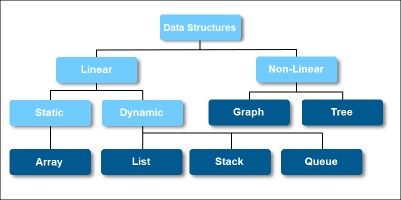

# 자료 구조

## 자료 구조(Data Structure) 란

> ***자료 구조는 데이터를 저장하고 구성하는데 사용된다. 또한 효율적으로 액세스하고 업데이트할 수 있도록*
*컴퓨터에서 데이터를 배치하는 방법이다.***

- 자료 구조는 데이터를 구성하는 데에만 사용하는 것이 아닌 검색, 저장, 처리하는 데에도 사용됨.
- 개발자의 손으로 만들어지는 프로그램 또는 소프트 웨어 시스템에서 사용되는 자료 구조에는 기본 및 고급까지 다양한 자료 구조가 존재함.
- **즉 자료 구조는 개발자에게 있어서 중요한 선수지식이 되야함.**

## 자료 구조의 분류

> 자료 구조는 크게 두 분류로 나뉜다. 선형 구조와 비 선형 구조에 대해서 알아보자.

- 선형 구조(Linear Data Structure) : 데이터 요소가 순차적, 선형으로 배치되고 각 요소 별 이전 요소와 다음 요소가 연결되어 있음.
  - 정적 선형 구조(Static Linear Data Structure)
    - 고정된 메모리 크기, 프로그래밍 시 공간을 지정해서 선언(**Python** 제외)
    - 정적 구소 내의 요소를 액세스에는 시간 복잡도 상 BigO(1). 즉, 메모리 적으로 가장 효율적.
    - 삽입, 삭제는 가장 뒤에서는 BigO(1), 허나 그 외의 위치에서는 BigO(N)
    - **배열**이 대표적인 예
  - 동적 선형 구조(Dynamic Linear Data Structure) :
    - 런타임 중에도 임의로 메모리 크기를 조절할 수 있음.
    - 삽입, 삭제 기능 포함.
    - **큐**, **스택** 이 대표적인 예
- 비선형 구조(Non-Linear Data Structure) : 데이터 요소가 비순차적이며 단일 실행일 경우 모든 요소를 순회할 수 없음.
  - **그래프**, **트리** 등이 대표적인 예
