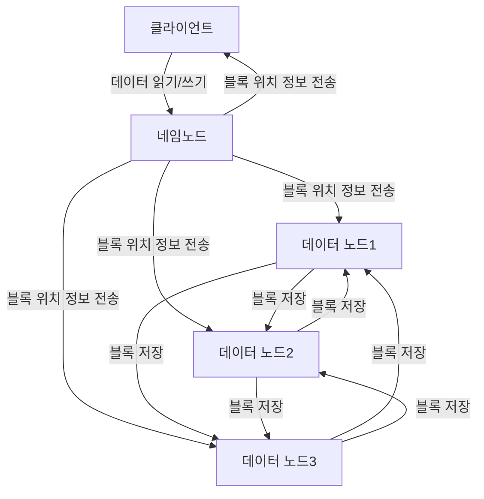

# Hadoop #3

## HDFS (Hadoop Distributed File System)

<!-- 
Hadoop 개요 및 아키텍처 이해
Hadoop이란 무엇인지, 어떻게 동작하는지 등에 대한 개념을 이해합니다.
HDFS가 Hadoop 아키텍처에서 어떤 역할을 하는지 파악합니다.
HDFS 구성 요소 이해
HDFS의 구성 요소인 네임노드, 데이터노드, 클라이언트 등의 역할과 동작 방식을 학습합니다.
각 구성 요소의 설정 방법과 관련된 명령어 등을 익힙니다.
HDFS 데이터 읽기 및 쓰기 이해
HDFS에서 데이터를 읽고 쓰는 방법과 과정을 이해합니다.
데이터의 블록 복제, 블록 크기 등과 같은 성능에 영향을 미치는 요소를 파악합니다.
HDFS 보안 이해
HDFS에서 제공하는 보안 기능인 인증, 권한 관리, 암호화 등을 학습합니다.
보안 설정 방법과 관련된 명령어 등을 익힙니다.
HDFS 클러스터 운영 및 관리 이해
HDFS 클러스터의 운영 및 관리 방법을 학습합니다.
네임노드, 데이터노드, 클라이언트, 스케줄러 등을 모니터링하고, 클러스터 설정 및 유지보수 등의 작업을 수행하는 방법을 익힙니다.
HDFS 확장 기술 이해
HDFS Federation, HDFS High Availability, HDFS Erasure Coding 등과 같은 확장 기술에 대해 학습합니다.
이러한 기술을 사용하여 HDFS 클러스터의 성능, 가용성, 안정성을 높이는 방법을 이해합니다.
HDFS 를 사용하는 방법.
 -->

### HDFS 의 개요

> HDFS 는 대용량 파일을 처리하는 분산 파일 시스템

- 파일 시스템을 구성하는 많은 노드들의 클러스터에서 실행되며, 대규모 데이터 집합을 안정적으로 저장하고 처리하는 데 활용됨.
- 일반적으로 데이터를 작은 블록으로 나누어 저장하고, 이러한 블록을 여러 노드에 저장함.
- 이러한 분산 저장으로 인해 대량의 데이터를 빠르게 읽고 쓸 수 있음.

#### HDFS 의 주요 특징

- 대용량 파일 저장 및 처리 가능
- 데이터를 여러 노드에 분산하여 저장하고 처리
- 고가용성 및 내결함성 제공
- 대규모 데이터 처리를 위한 많은 분산 시스템(Hive, MapReduce, Pig..etc)과 통합될 수 있음.

> #### 고가용성? 내결함성?
>
> **고가용성** : 시스템이 항상 가용하도록 유지되는 것
>
> - example) 시스템의 하드웨어가 고장나거나 네트워크에 장애가 발생해도 데이터나 서비스를 계속해서 제공할 수 있음.
>   - 이와 같은 경우 시스템의 구성 요소가 중복으로 되어 있기에, 어느 하나가 고장나도 다른 구성 요소로 서비스를 유지할 수 있도록 설계되어야 함.
>
> **내결함성** : 시스템이 장애 상황에서도 데이터나 서비스를 정확하게 제공할 수 있는 능력
>
> - example) 데이터가 손실되거나 손상되지 않고 복구될 수 있어야 함.
>   - 이와 같은 경우 데이터가 여러 개의 노드에 분산 저장되거나, 복제되어 저장되어야 함.
> 고가용성과 내결함성은 HDFS 와 같은 분산 파일 시스템에서 매우 중요한 요소로 항상 고려되어야 함.

### HDFS 의 구성 요소

1. **클라이언트**(Client) : HDFS 에 데이터를 읽고 쓰는 요청을 보내는 역할
   1. 네임노드에게 파일의 메타데이터를 요청하고,
   2. 데이터노드에게는 해당 파일의 데이터 블록을 읽거나 쓰는 요청을 함.
2. **네임노드**(NameNode) : 파일 시스템의 메타데이터를 관리, 어떤 데이터 블록이 어느 노드에 저장되어 있는지를 알고 있음. 네임노드는 클러스터에서 하나만 존재하며, **네임노드가 다운되면 HDFS 전체가 사용불가능해질 정도로 영향력이 큼.**
3. **데이터노드**(DataNode) : 실제로 데이터 블록을 저장하고 처리하는 역할, 네임노드에 자신이 관리하는 블록의 목록과 블록의 복제상태를 주기적으로 보고.
4. **블록**(Block) : 대용량 파일을 작은 블록으로 나누어 저장하는 단위. HDFS 에서는 일반적으로 128MB 이상의 크기로 설정됨.
5. **블록 복제**(Block Replication) : 데이터 블록을 여러 노드에 복제하여 저장하는 기능 -> 이를 통해 데이터를 안정적으로 **고가용성과 내결함성을 확보.**, 일반적으로 HDFS 는 데이터 블록을 3개 이상 복제함.
